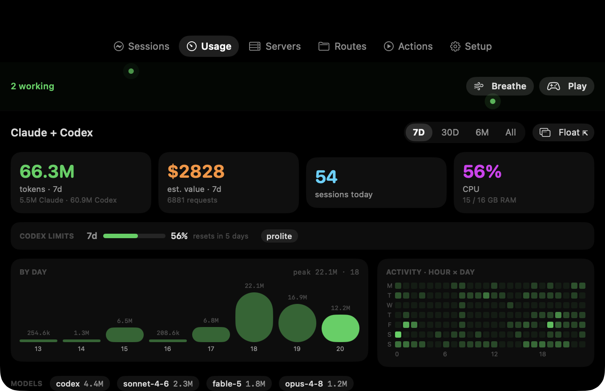

# AgentNotch

Native macOS menu bar + notch app that monitors your local coding-agent sessions (Claude Code, Codex) — live states, transcripts, token usage, dev servers, plus calm focus tools for when a busy fleet gets overwhelming. Open-source, built from scratch in SwiftUI.



## Features

- **Notch panel** — hover into the notch (or right-click menu bar icon → Toggle) → tabbed panel: Sessions / Usage / Servers / Routes / Actions / Setup.
- **Sessions** — Claude Code + Codex, live states (Working / Needs you / Idle / Finished), project, branch, model, token count, last reply, filter box. Expand a card for:
  - inline **todos** with progress (from TodoWrite)
  - **transcript** timeline (YOU / AGENT / TOOL rows with command detail)
  - **direct chat** — send a follow-up into the session (`claude --resume` / `codex exec resume`)
  - **Terminal / Finder** jump buttons, pop-out Todos/Transcript widgets
- **Usage** — dock.cool-style dashboard with a **7D / 30D / 6M / All** range picker: big-number stat tiles (tokens with Claude/Codex split, est. $ value, sessions today, live CPU/RAM), adaptive bar chart (day/week/month buckets), hour×day activity heatmap (7D), per-model chips, 5h/24h breakdowns. **Codex included**: per-session cumulative totals from rollout `token_count` events, plus a real Codex rate-limit card (used %, reset time, plan) read from Codex's own reports. Switching range shows a **loader** — skeleton tiles + a determinate top progress bar with a live "scanning N/M logs" count (cold), or dimmed current data (warm). Cached per-file scans off the main thread; the first All pass over full history is slow once, then instant.
- **Agent Swarm** — an ambient micro-visualization in the panel header: one drifting green firefly per running agent, an orange blinking mote per agent waiting on a permission prompt. It only animates while agents run **and** a panel is on screen (gated so it never burns CPU off-screen), collapses to nothing when idle, and tapping it jumps to Sessions. While agents are working it also surfaces two off-ramp buttons: **Breathe** (Focus space) and **Play** (Games).
- **Games** — three calm, turn-based games in a floating window for a real mental break while agents run — no reflexes, no timers: **2048** (merge tiles with the arrow keys), **Memory** (flip and match pairs), and **Minesweeper** (9×9, click to reveal, right-click/Ctrl-click to flag). Switch between them in-window; "New" restarts. The same live **agent-status pill** as the Breathe screen sits at the top ("3 working" → "All agents done") so you can keep half an eye on the fleet while you play. Open from the **Play** button in the swarm band, or the menu-bar right-click menu → **Games** (⌘P).
- **Focus space** — a calm, floating window with three no-pressure modes to steady you when many agents leave you scattered. **Breathe**: a box (4·4·4·4) or 4·7·8 breathing pacer — a soft teal orb that grows and shrinks to guide your breath. Pick a session length (3 / 6 / 10 breaths); a progress ring around the orb fills as you go, with a live "N / target breaths · m:ss left" readout, so you always know how far along you are and when you're finished — it ends on a calm "Done" screen (breaths · duration) with a Start-again button, no open-ended sitting. A live **agent-status pill** sits at the top ("4 working", "2 need you") and flips to **"All agents done"** the moment your fleet finishes — so you can breathe *and* watch for when the work is over. It tints amber and whispers "finish this breath first" if an agent is waiting, so awareness never breaks the calm. **Drift**: a slow ambient field to rest your eyes on. **Focus**: one agent at a time, big and quiet ("one thing at a time"), stepping through your fleet one card at a time so 39 sessions stop overwhelming — with an Open button to jump into it. Animations are pure functions of time and only run while the window is open. Launch from the **Breathe** button in the swarm band, or the menu-bar right-click menu → **Focus space** (⌘F).
- **Storage** (Setup tab) — a safe disk cleaner. Classification was adversarially verified: only genuinely regenerable cache is one-click "safe" to clear; reclaimable-with-a-tradeoff items (Codex generated images, old session logs 90+ days, Codex log DB) are per-item behind a confirmation that spells out what you lose. Your session history, plugins, command logs, pastes, and login records are never offered — they're your data or things running agents still depend on.
- **Servers** — listening ports 3000–9999 with framework detection, project name, open / copy URL / stop.
- **Routes** — labeled grid of agent folders/files (skills, plugins, hooks, settings, sessions, logs) for Claude + Codex. Only shows what exists.
- **Actions** — save shell commands, run/stop from the panel. Stored in `~/.agentnotch/actions.json`.
- **Board** — right-click menu → Agent Board: floating kanban (Active / Attention / Finished), click a card to open its terminal.
- **Widgets** — floating always-on-top Todos, Transcript (live-refreshing), and Usage panels.
- **Permission alerts** — Setup tab installs an opt-in, non-blocking event-logger hook into `~/.claude/settings.json` (Notification/Stop/UserPromptSubmit, `async:true`, backs up settings first). Sessions waiting on permission turn orange, jump to top, badge the menu bar icon, and show the ask.

Everything local. No network, no accounts, no telemetry.

## Requirements

- macOS 14+, Apple silicon (notch optional — everything also works from the menu bar)
- Claude Code and/or Codex CLI installed for anything to show up

## Install (DMG)

1. Download `AgentNotch.dmg` from the [latest release](../../releases/latest).
2. Open it and drag **AgentNotch** into **Applications**.
3. Launch it. That's it — the app is signed with a Developer ID and notarized by Apple, so it opens with a normal double-click, no Gatekeeper warning.

It lives in the menu bar (and the notch) — there's no Dock icon. Right-click the menu-bar icon for the menu; hover into the notch for the panel.

## Free — tips welcome

AgentNotch is free and open-source (MIT). If it saves you some sanity while wrangling a fleet of agents, you can leave a tip: **[❤️ Tip jar](https://TIP-URL-HERE)**. Totally optional — a GitHub star helps just as much.

## Build from source

```bash
swift build
.build/debug/AgentNotch          # menu bar app
.build/debug/AgentNotch --show   # same, opens notch panel immediately
.build/debug/AgentNotch --cli    # one-shot text dump of all subsystems
```

Package your own DMG:

```bash
./scripts/build-dmg.sh 0.1.0                       # ad-hoc signed
SIGN_ID="Developer ID Application: … (TEAMID)" \
  NOTARY_PROFILE=NOTARY ./scripts/build-dmg.sh 0.1.0   # signed + notarized
```

With a **Developer ID Application** cert in your keychain the script signs with a hardened runtime; add a stored notary profile (`xcrun notarytool store-credentials`) and it notarizes + staples so the app opens with a plain double-click — no Gatekeeper prompt. Without a cert it ad-hoc signs (works fine, needs the one-time right-click-Open).

The app icon is checked in (`scripts/AppIcon.icns`). To redraw it, edit and run `scripts/make-icon.py` (needs Python + Pillow).

Other debug flags: `--usage` / `--setup` (open panel on that tab), `--focus`, `--games`, `--all-range`, `--all-time` (with `--cli`).

## What it touches on your Mac

Transparency, since this app reads agent data:

- **Reads** `~/.claude/projects` and `~/.codex/sessions` (session JSONLs) plus a few config paths for Quick Routes. Read-only.
- **Writes** only `~/.agentnotch/` (saved actions, hook events).
- **Opt-in hook**: the Setup tab can append a non-blocking, async event-logger to `~/.claude/settings.json` (backs the file up first, one-click remove). Nothing is installed without you clicking Install.
- **Storage cleaner** deletes only the exact paths listed in its UI, the risky ones behind an explicit confirmation. Session history, plugins, logs-as-records, and pastes are never offered.
- **Direct chat** shells out to `claude --resume … -p` / `codex exec resume` with **default permissions** — a prompt typed in the notch can't silently approve edits.
- **Servers stop button** sends SIGTERM to the listed pid. **Actions** run the shell commands you saved, verbatim.

## Known limits

- Direct chat replies land in a continuation session file → new row.
- Claude rate-limit % (5h/7d windows) isn't shown — local logs carry token totals, not limits. (Codex limits ARE shown; Codex writes them locally.)
- In-notch permission *answering* needs a blocking PreToolUse hook — the current hook is alert-only by design (zero risk of slowing your sessions).
- Views (multi-pane terminal workspaces) and agents beyond Claude Code/Codex: not built yet. PRs welcome.

## License

MIT — see [LICENSE](LICENSE).
